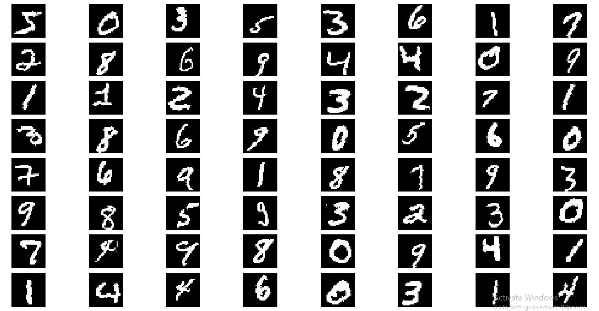

# MNIST Digit Classification with PyTorch

[](https://github.com/rpratesh/MNIST_Pytorch_GitActions/actions/workflows/model_test.yml)

This project implements a Convolutional Neural Network (CNN) for classifying handwritten digits from the MNIST dataset using PyTorch. The implementation includes automated testing using GitHub Actions to ensure model performance and parameter constraints.

## Project Structure

```
├── model.py                 # CNN model architecture
├── train_test.py            # Training and testing functions
├── MNIST dataset            # Offline dowloaded MNIST dataset
├── stitch_aug_images.py     # Utility Script to create a grid of augmented images
├── .github/
│   └── workflows/
│       └── model_test.yml  # GitHub Actions
└── README.md
```
## Model Architecture

The CNN architecture consists of:
- 3 convolutional layers with increasing filter sizes (8, 16, 32)
- Max pooling layers
- Dropout for regularization
- A fully connected layer for final classification
- Total parameters = 13,898

## Model Performance

The model achieves the following targets (on MNIST dataset):
- Training accuracy: > 95% after 1 epoch
- Test accuracy: > 95% after 1 epoch
- Parameter count: < 25,000 parameters

## Requirements

- Python 3.8+
- PyTorch
- torchvision
- numpy
- pytest

Install dependencies:
```
bash
pip install torch torchvision --index-url https://download.pytorch.org/whl/cpu
pip install pytest numpy
```

## Usage
To train the model
```
python train_test.py
```
It prints following logs after training without image augmentation:  
Total parameters: 13,898  
Epoch: 1  
Average training Loss: 0.1549  
Training Accuracy: 95.2567  
Average test loss: 0.0514  
Test Accuracy: 98.36  

Training logs with image augmentation:  
Total parameters: 13,898  
Epoch: 1  
Average training Loss: 0.3047  
Training Accuracy: 90.4700  
Average test loss: 0.0526  
Test Accuracy: 98.55  

A sample of augmented images:  


### Automated Testing

The project includes automated tests that run on GitHub Actions. The tests verify:
1. Model parameter count (< 25,000 parameters)
2. Training accuracy (> 95% after 1 epoch)
3. Test accuracy (> 95%)
4. Data normalisation values (mean and standard dev) of MNIST dataset used in dataset transforms are correct or not
5. If the model can handle the correct input shape (28x28x1) and produces the expected output shape (1x10).
6. That data augmentation is working as expected, by comparing a batch of data with and without augmentation.


## GitHub Actions Workflow

The project uses GitHub Actions to automatically run tests on push and pull requests to main/master branches. The workflow:
1. Sets up Python environment
2. Installs dependencies
3. Creates and runs test file
4. Verifies model performance and constraints

## License

This project is open source and available under the MIT License.

## Acknowledgments

- MNIST Dataset: [LeCun et al.](http://yann.lecun.com/exdb/mnist/)
- PyTorch Documentation and Tutorials


